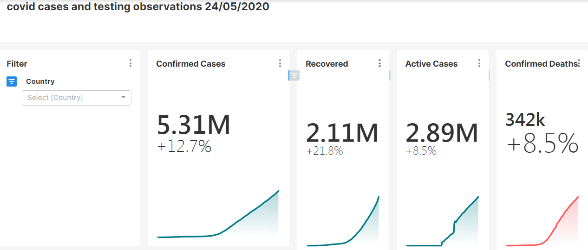
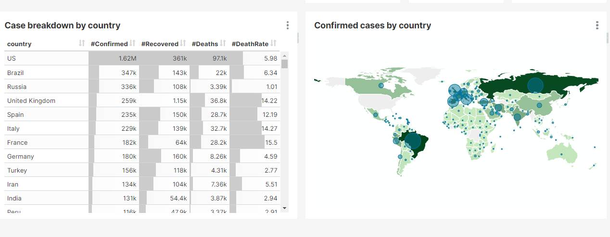
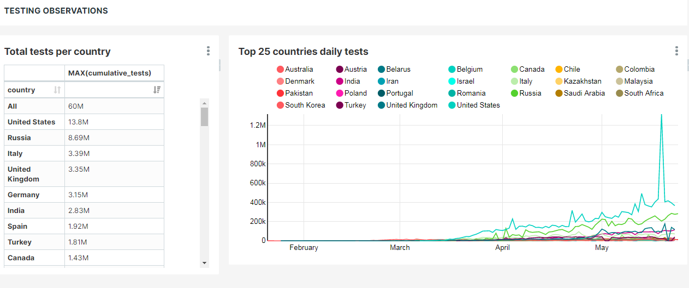

# Covid19-VoiceAssistant

A corona-virus voice assistant that responds to corona related questions

###  Prerequisites
- pyttsx3 is a text-to-speech conversion library in python
- PyAudio provides Python bindings for PortAudio, the cross-platform audio I/O library
- SpeechRecognition library for performing speech recognition

### Details 
Covid19 data curated from https://www.worldometers.info/ and used to answer COVID related questions.
https://github.com/Onroe/Covid19-VoiceAssistant/blob/master/Covid19_Voice_Assistant.ipynb

##COVID REPORT

Summary report of covid19 data sourced from JohnHopkins Covid dataset
(https://github.com/CSSEGISandData/COVID-19/tree/master/csse_covid_19_data/csse_covid_19_daily_reports)
Refer to the pictures below.

